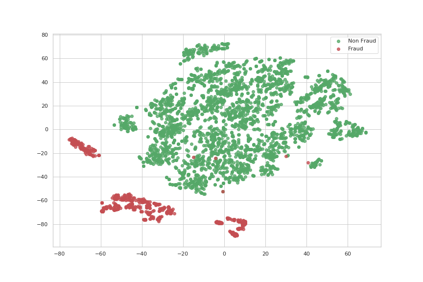
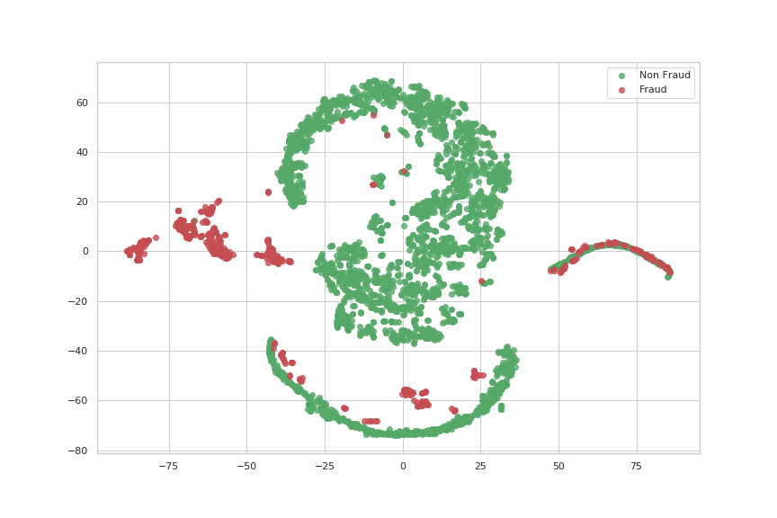
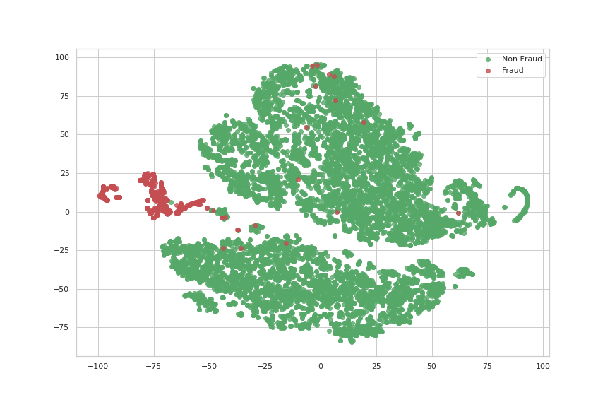
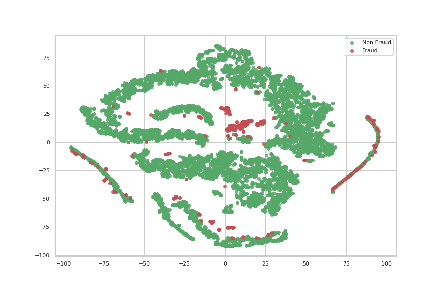

# 12_Fraud-Detection-using-Quantum Machine Learning                          
### 
**Mentors:** Nouhaila Innan; Muhammad Al-Zafar Khan; Ioannis Theodonis       
### 
**Description:** This project aims to enhance security and accuracy in fraud  detection by utilizing quantum computing and quantum machine learning. We     will leverage these fields’ unique properties to develop advanced algorithms  that effectively detect fraudulent patterns and anomalies in large datasets.  Our research will involve algorithm design, simulation, integration with      existing systems, and performance optimization. This project’s results
    can    potentially revolutionize fraud detection and bolster the resilience of       financial systems and online transactions.
___
___

# Details about the Classical Autoencoder
Dataset used - [https://www.kaggle.com/datasets/mlg-ulb/creditcardfraud](https://www.kaggle.com/datasets/mlg-ulb/creditcardfraud)

## Structure of the Auto Encoder
- Layer 1 : 100 neurons ("elu")
- Layer 2 : 50 neurons ("elu")
- Layer 3 : 25 neurons ("elu")

(A symmetrical structure has been used for the decoder part)
- optimizer : adadelta
- loss : MSE

## Structure of the Neural Network
- Layer 1 : 10 neurons ("relu")
- Layer 2 : 10 neurons ("relu")
- optimizer : adam
- loss : binary_crossentropy

___
## Run 1
### Manual Parameters
```
RANDOM_SEED = 42 # the answer to the life, universe, and everything
SAMPLE_SIZE = 10000
SPLIT_RATIO = 0.2
BATCH_SIZE = 1024
EPOCHS = 25
```

> non_fraud_hid_scaled_rep = hidden_scaled_representation.predict(xs_non_fraud[:3000])

>non_fraud_hid_unscaled_rep = hidden_unscaled_representation.predict(xu_non_fraud[:3000])


### SCALED Linear Regression
```
Classification Report: 
    Fraud   precision    recall  f1-score   support
    0.0       0.99       1.00      1.00       749
    1.0       0.99       0.95      0.97       124

micro avg      0.99      0.99      0.99       873
macro avg      0.99      0.98      0.98       873
weighted avg   0.99      0.99      0.99       873
Accuracy Score:  0.9919816723940436
```

### UNSCALED Linear Regression
```
Classification Report: 
            precision    recall  f1-score   support
    0.0       0.99      1.00      1.00       742
    1.0       1.00      0.97      0.98       131

micro avg       1.00      1.00      1.00       873
macro avg       1.00      0.98      0.99       873
weighted avg       1.00      1.00      1.00       873
Accuracy Score:  0.995418098510882
```


### SCALED SVM
```
Classification Report: 
            precision    recall  f1-score   support
    0.0       0.99      1.00      1.00       749
    1.0       1.00      0.94      0.97       124

micro avg       0.99      0.99      0.99       873
macro avg       1.00      0.97      0.98       873
weighted avg       0.99      0.99      0.99       873
Accuracy Score:  0.9919816723940436
```

### UNSCALED SVM
```
Classification Report: 
            precision    recall  f1-score   support
    0.0       0.99      0.99      0.99       742
    1.0       0.94      0.93      0.93       131

micro avg       0.98      0.98      0.98       873
macro avg       0.96      0.96      0.96       873
weighted avg       0.98      0.98      0.98       873
Accuracy Score:  0.980526918671248
```

| ORIGINAL   |     SCALED LATENT    |  UNSCALED LATENT |
|----------|:-------------:|------:|
| |     | 
 |

___
## Run 2
### Manual parameters
```
RANDOM_SEED = 42 # the answer to the life, universe and everything
SAMPLE_SIZE = 10000
SPLIT_RATIO = 0.2
BATCH_SIZE = 1024
EPOCHS = 25
NN_EPOCH = 50
NN_BATCH_SIZE = 20
```

> non_fraud_hid_scaled_rep = hidden_scaled_representation.predict(xs_non_fraud[:SAMPLE_SIZE])

> non_fraud_hid_unscaled_rep = hidden_unscaled_representation.predict(xu_non_fraud[:SAMPLE_SIZE])


**A new Neural Network has been added to classify the latent space**

### SCALED LR
```
Classification Report: 
              precision    recall  f1-score   support
        0.0       0.99      1.00      0.99      2491
        1.0       1.00      0.77      0.87       132

micro avg       0.99      0.99      0.99      2623
macro avg       0.99      0.89      0.93      2623
weighted avg       0.99      0.99      0.99      2623

Accuracy Score:  0.988562714449104
```

## UNSCALED LR
```
Classification Report: 
              precision    recall  f1-score   support
        0.0       1.00      1.00      1.00      2500
        1.0       0.98      0.92      0.95       123
micro avg       1.00      1.00      1.00      2623
macro avg       0.99      0.96      0.97      2623
weighted avg       1.00      1.00      1.00      2623

Accuracy Score:  0.9954250857796416
```

### SCALED SVM
```
Classification Report: 
              precision    recall  f1-score   support
        0.0       0.98      1.00      0.99      2491
        1.0       1.00      0.68      0.81       132

micro avg       0.98      0.98      0.98      2623
macro avg       0.99      0.84      0.90      2623
weighted avg       0.98      0.98      0.98      2623

Accuracy Score:  0.9839878002287457
```

### UNSCALED SVM
```
Classification Report: 
              precision    recall  f1-score   support
        0.0       0.99      1.00      0.99      2500
        1.0       0.98      0.80      0.88       123

micro avg       0.99      0.99      0.99      2623
macro avg       0.99      0.90      0.94      2623
weighted avg       0.99      0.99      0.99      2623

Accuracy Score:  0.9897064430041936
```

### SCALED NN
```
acc: 0.9967
val_f1: 0.9846153846153847
val_precision: 1.0
val_recall 0.9696969696969697
```

### UNSCALED NN
```
acc: 0.9917
val_f1: 0.9224137931034483
val_precision: 0.981651376146789
val_recall 0.9105691056910569
```

| ORIGINAL   |     SCALED LATENT    |  UNSCALED LATENT |
|----------|:-------------:|------:|
| |     | 
 |


